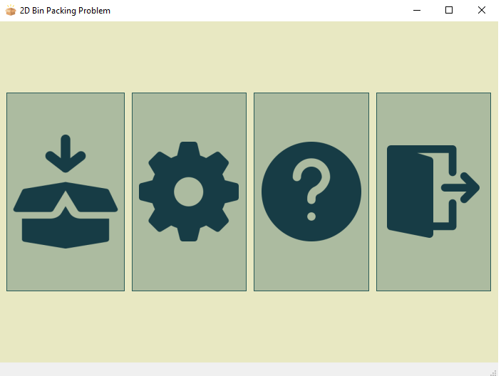
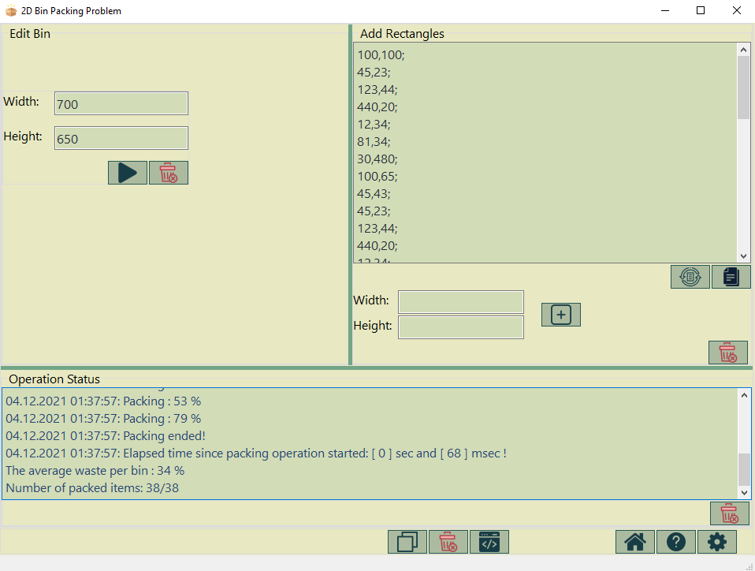
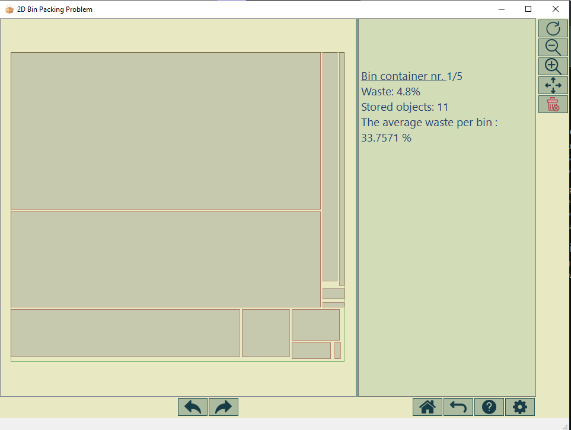

# 2D_BPP_gui

- a gui for bin packing problem (rectangle approach)
- it use another thread for packing as a result : the app doesn't freeze in long tasks
- there are two methods for packing rectangles
  
  

